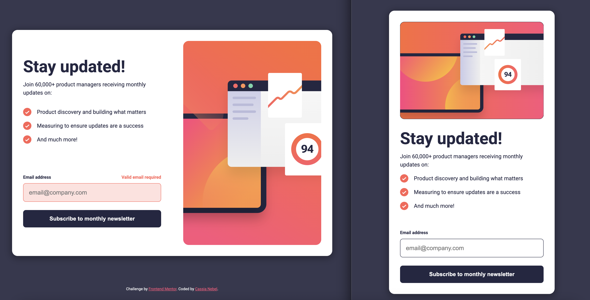

# Frontend Mentor - Newsletter sign-up form with success message solution

This is a solution to the [Newsletter sign-up form with success message challenge on Frontend Mentor](https://www.frontendmentor.io/challenges/newsletter-signup-form-with-success-message-3FC1AZbNrv). Frontend Mentor challenges help you improve your coding skills by building realistic projects.

### The challenge

Users should be able to:

- Add their email and submit the form
- See a success message with their email after successfully submitting the form
- See form validation messages if:
  - The field is left empty
  - The email address is not formatted correctly
- View the optimal layout for the interface depending on their device's screen size
- See hover and focus states for all interactive elements on the page

### Screenshot



### Links

- Live Site URL: https://cassianebel.github.io/newsletter-sign-up-with-success-message/

### Built with

- Semantic HTML5 markup
- CSS custom properties
- Flexbox
- Mobile-first workflow
- Vanilla JS

### What I learned

I learned how to animate the gradient background of a button on hover using CSS (see below).
I aslo learned how to replace the `li::marker` with an svg (also below).

```css
button {
  background: linear-gradient(
    to right,
    var(--blue-800),
    var(--blue-800),
    var(--red),
    var(--red),
    var(--pink)
  );
  background-size: 400% 100%; /* Make the gradient wider than the element */
  background-position: 0% 0%;
  transition: background-position 0.5s ease, box-shadow 0.5s ease;
}

button:hover,
button:active,
button:focus {
  background-position: 100% 0%; /* Slide the gradient to the right */
  box-shadow: 0 6px 20px 10px hsla(4, 100%, 67%, 0.3);
}

ul {
  list-style-type: none;
  padding-left: 0;
}

li {
  position: relative;
  padding-left: 2.5rem;
  margin-bottom: 1rem;
}

li::before {
  content: "";
  position: absolute;
  left: 0;
  top: 0;
  width: 1.5rem;
  height: 1.5rem;
  display: inline-block;
  background: no-repeat center / contain url("./assets/images/icon-list.svg");
}
```
